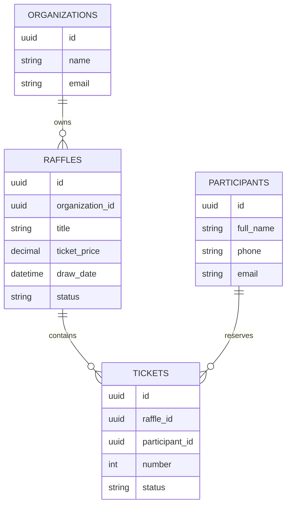

# Entity Relationship Diagram

```mermaid
erDiagram

ORGANIZATIONS ||--o{ RAFFLES : owns

RAFFLES ||--o{ TICKETS : contains

PARTICIPANTS ||--o{ TICKETS : reserves

ORGANIZATIONS {

uuid id

string name

string email

}

RAFFLES {

uuid id

uuid organization_id

string title

decimal ticket_price

datetime draw_date

string status

}

PARTICIPANTS {

uuid id

string full_name

string phone

string email

}

TICKETS {

uuid id

uuid raffle_id

uuid participant_id

int number

string status

}
```